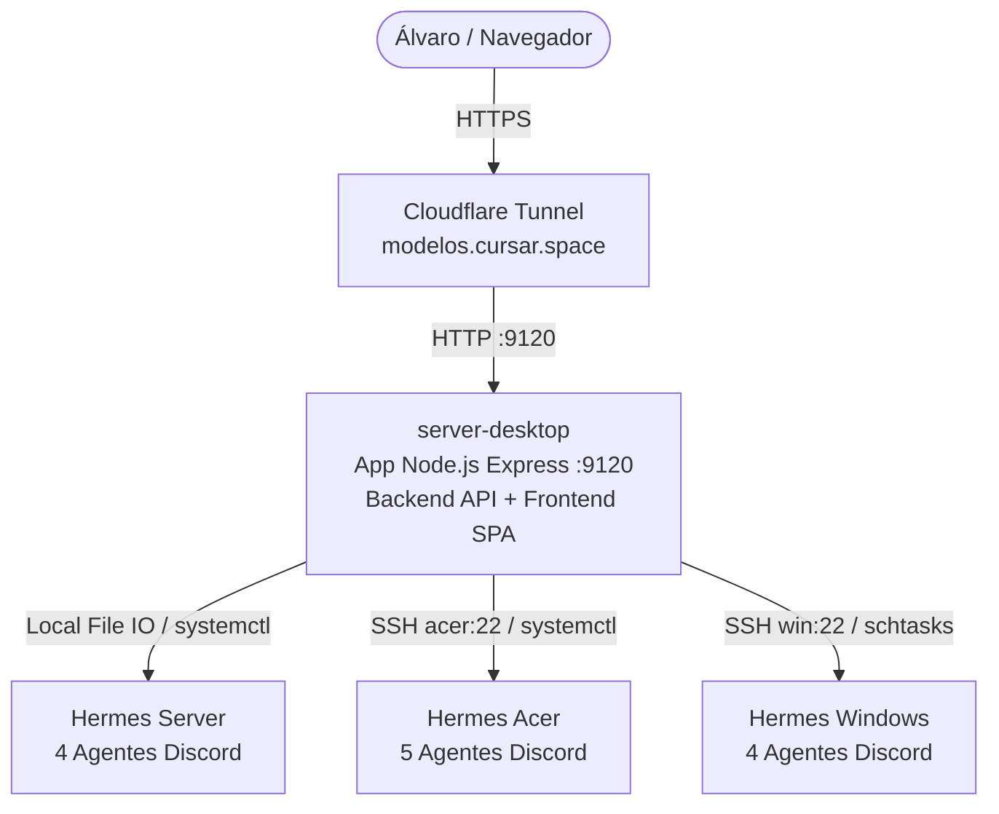

# 01. Arquitetura e Mapa da Frota Hermes

Documento de referência técnica com a topologia, diretórios, formato de arquivos de configuração, comandos de gerenciamento, infraestrutura de hospedagem no `server-desktop` e exposição via domínio `cursar.space`.

---

## 1. Topologia da Frota e Hospedagem do Painel

O painel **Controle de Modelos Hermes** roda de forma unificada (Backend Express + Frontend estático) no computador **`server-desktop`** (máquina Linux de produção contínua 24/7). A partir dele, o servidor alcança a própria máquina localmente e os outros dois computadores via SSH pela malha Tailscale.



### Detalhes dos Três Nós da Frota:

| Computador | Hostname | IP Tailscale | Usuário SSH | SO / Papel | Hermes Home |
|---|---|---|---|---|---|
| **server-desktop** *(Host Central)* | `server-desktop` | `100.65.138.58` | `server` | Ubuntu Linux (Produção 24/7, Hosting do Site) | `/home/server/.hermes` |
| **acer** | `acer-Aspire-A515-45` | `100.102.202.63` | `acer` | Ubuntu Linux (Notebook Dev / IMAP) | `/home/acer/.hermes` |
| **windows** | `PCQUE001IMAP` | `100.102.60.73` | `usuario` | Windows 10/11 (Estação GIS / APF RT) | `C:\Users\Usuario\AppData\Local\hermes` |

---

## 2. Hospedagem e Domínio `cursar.space`

- **Host da Aplicação**: `server-desktop` (diretório `/media/server/HD Backup/Servidores_NAO_MEXA/controle_modelos`).
- **Arquitetura Unificada**: O servidor Node.js/Express roda na porta `9120`, gerenciando tanto os endpoints da API (`/api/*`) quanto a entrega dos assets estáticos do Frontend (`/public/*`).
- **Domínio Público**: `https://modelos.cursar.space` (ou `https://controle-modelos.cursar.space`).
- **Exposição Segura via Cloudflare Tunnel**:
  - Túnel `cloudflared` configurado no `server-desktop` apontando `http://localhost:9120`.
  - Sem necessidade de abertura de portas no roteador local.
  - Acesso direto sem senha (sem tela de login), conforme definido pelo Álvaro.

---

## 3. Mapa dos 13 Agentes Discord por Computador

Cada canal do Discord representa um agente com identidade (`SOUL.md`), memória (`memories/MEMORY.md`) e configuração (`config.yaml`) isoladas. O gateway de cada PC utiliza `profile_routes` e `gateway.multiplex_profiles: true` para despachar as mensagens.

### A. server-desktop (Guild: *Hermes Hub* `1528221963229859961`)
*Bot ID: `1528220071883837624`*

| Perfil | Canal Discord | ID do Canal | Papel Principal | Caminho do `config.yaml` |
|---|---|---|---|---|
| `default` (raiz) | `🖥️｜hermes-server-desktop` | `1528227053265096867` | Orquestrador e Geral Server | `/home/server/.hermes/config.yaml` |
| `geoforest` | `🌲｜geoforest` | `1540428678268457021` | Dev & Backend GeoForest-IA | `/home/server/.hermes/profiles/geoforest/config.yaml` |
| `acompanhamento`| `📁｜acompanhamento` | `1540428680361410661` | Processos, Prazos e Firestore | `/home/server/.hermes/profiles/acompanhamento/config.yaml` |
| `wms` | `🗺️｜wms` | `1540428682429079602` | GeoServer e Mapas WMS | `/home/server/.hermes/profiles/wms/config.yaml` |

### B. acer (Guild: *Hermes Acer* `1528545203869450381`)

| Perfil | Canal Discord | ID do Canal | Papel Principal | Caminho do `config.yaml` |
|---|---|---|---|---|
| `default` (raiz) | `💻｜hermes-acer` | `1528549192774193314` | Orquestrador e Geral Acer | `/home/acer/.hermes/config.yaml` |
| `trello` | `📋｜trello-simcar` | `1540411181972463697` | Gestão Board SIMCAR (Trello) | `/home/acer/.hermes/profiles/trello/config.yaml` |
| `acompanhamento`| `📁｜acompanhamento` | `1540411184153366609` | CLI IMAP e Chrome Automação | `/home/acer/.hermes/profiles/acompanhamento/config.yaml` |
| `geoforest` | `🌲｜geoforest` | `1540414298432479252` | Suporte Dev GeoForest | `/home/acer/.hermes/profiles/geoforest/config.yaml` |
| `solicitacoes` | `✉️｜solicitacoes` | `1540414300286615683` | Processamento E-mails/Outlook | `/home/acer/.hermes/profiles/solicitacoes/config.yaml` |

### C. windows `pcque001imap` (Guild: *Hermes Windows* `1540593890120433754`)

| Perfil | Canal Discord | ID do Canal | Papel Principal | Caminho do `config.yaml` |
|---|---|---|---|---|
| `default` (raiz) | `🪟｜hermes-windows` | `1540595104044032020` | Orquestrador e Geral Windows | `C:\Users\Usuario\AppData\Local\hermes\config.yaml` |
| `cartografo` | `🗺️｜cartografo` | `1540595107584278589` | ArcGIS / MXD e APF Rural | `C:\Users\Usuario\AppData\Local\hermes\profiles\cartografo\config.yaml` |
| `documentos` | `📄｜documentos` | `1540595111392452638` | Office, SIGA-DOC, OCR | `C:\Users\Usuario\AppData\Local\hermes\profiles\documentos\config.yaml` |
| `zelador` | `🧹｜zelador` | `1540595114731114576` | Rotinas de Manutenção e Vault | `C:\Users\Usuario\AppData\Local\hermes\profiles\zelador\config.yaml` |

---

## 4. Estrutura do Arquivo de Configuração (`config.yaml`)

O `config.yaml` de cada agente define o modelo principal, o provedor, o endpoint base e os parâmetros de raciocínio (*thinking / reasoning effort*).

### Exemplo de Bloco de Modelo no `config.yaml`:
```yaml
model:
  default: ox-alpha-free
  provider: opencode-go
  base_url: https://opencode.ai/zen/go/v1
  api_mode: chat_completions

agent:
  max_turns: 500
  reasoning_effort: max
  reasoning_overrides:
    ox-alpha-free: max
    deepseek-v4-flash: medium
    grok-4.6: high
    hy3: high

delegation:
  reasoning_effort: max
  model: ox-alpha-free
  allowed_models:
    - ox-alpha-free
```

### Principais Modelos e Provedores Suportados na Frota:
1. **`ox-alpha-free`** (Provider: `opencode-go`, Base URL: `https://opencode.ai/zen/go/v1`):
   - *Reasoning permitido:* `low`, `high`, `max` (não aceita `medium` ou `xhigh` — volta HTTP 400).
   - Requer o patch local `patch-ox-alpha.py` nos hosts para emitir `reasoning_effort` no fio.
2. **`deepseek-v4-flash`** (Provider: `opencode-go` ou `openrouter`):
   - *Reasoning permitido:* `low`, `medium`, `high`.
3. **`hy3`** (Provider: `opencode-go`):
   - *Reasoning permitido:* `low`, `high`. (Consome 8x a cota no plano Go).
4. **`grok-4.6`** (Provider: `xai-oauth`, Base URL: `https://api.x.ai/v1`):
   - *Reasoning permitido:* `low`, `high`.
5. **`deepseek-v4-pro`** (Provider: `deepseek-standard`, Base URL: `https://api.deepseek.com/v1`).

---

## 5. Comandos de Gerenciamento e Serviços por SO

### A. server-desktop (Linux)
- **Status do Gateway**: `systemctl --user status hermes-gateway.service`
- **Reiniciar Gateway**: `systemctl --user restart hermes-gateway.service`
- **Testar Perfis**: `python3 ~/.hermes/scripts/testar-provider-perfil.py [perfil]`
- **Executar Cura**: `bash ~/.hermes/scripts/checar-perfis.sh`
- **Logs do Gateway**: `journalctl --user -u hermes-gateway.service -n 50 --no-pager`

### B. acer (Linux via SSH)
- **Status do Gateway**: `ssh acer "systemctl --user status hermes-gateway.service"`
- **Reiniciar Gateway**: `ssh acer "systemctl --user restart hermes-gateway.service"`
- **Testar Perfis**: `ssh acer "python3 ~/.hermes/scripts/testar-provider-perfil.py [perfil]"`
- **Executar Cura**: `ssh acer "bash ~/.hermes/scripts/checar-perfis.sh"`
- **Logs do Gateway**: `ssh acer "journalctl --user -u hermes-gateway.service -n 50 --no-pager"`

### C. windows (Windows via SSH)
- **Status do Gateway**: `ssh windows "tasklist /FI \"IMAGENAME eq python.exe\""`
- **Reiniciar Gateway**: `ssh windows "hermes gateway stop && schtasks /Run /TN HermesGateway"`
- **Testar Perfis**: `ssh windows "C:\Users\Usuario\AppData\Local\hermes\hermes-agent\venv\Scripts\python.exe C:\Users\Usuario\AppData\Local\hermes\scripts\testar-provider-perfil.py [perfil]"`
- **Executar Cura**: `ssh windows "powershell -ExecutionPolicy Bypass -File C:\Users\Usuario\AppData\Local\hermes\scripts\checar-perfis.ps1"`
- **Logs**: `ssh windows "Get-Content C:\Users\Usuario\AppData\Local\hermes\logs\gateway.log -Tail 50"`

---

## 6. Armadilhas e Regras Críticas (Gotchas)

1. **Backups Obrigatórios**: Toda e qualquer alteração de `config.yaml` deve criar uma cópia datada de segurança (ex: `config.yaml.bak-controle-<timestamp>`).
2. **Preservação de Formato YAML**: Não use serializers genéricos de YAML que apagam comentários ou alteram a ordem das chaves.
3. **Escopo de Segredos no Multiplex**: Cada perfil secundário possui seu próprio arquivo `.env`. Ao criar ou ajustar perfis, nunca adicione `DISCORD_BOT_TOKEN` ou `API_SERVER_KEY` dentro do `.env` dos perfis secundários.
4. **Armadilha do SSH Aninhado no Windows**: O Windows trava se um comando SSH disparado nele tentar abrir outro SSH. Comandos no Windows devem ser executados via comandos nativos ou Scheduled Tasks.
5. **Patch do Ox Alpha**: O provider `opencode-go` exige o patch `patch-ox-alpha.py` para mapear `reasoning_effort` no modelo `ox-alpha-free`.
